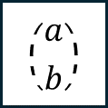

Boundary Nodes
=========

Operators are core functional elements that manipulate data within the model. They can perform mathematical, logical, or quantum operations.

Operator categories:

- **Arithmetic**: Add, Subtract, Multiply
- **Logical**: AND, OR, NOT
- **Quantum Gates**: Hadamard (H), Pauli-X, CNOT

